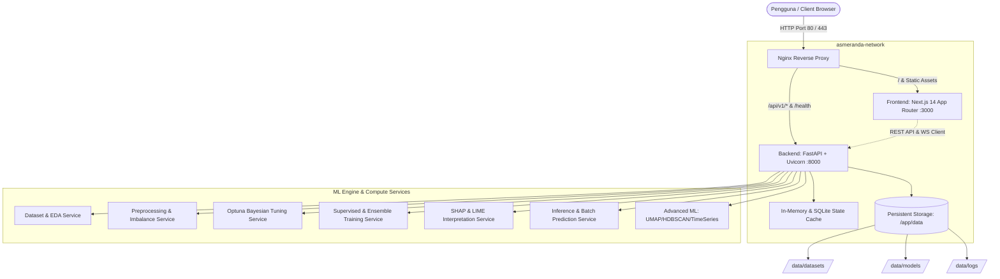
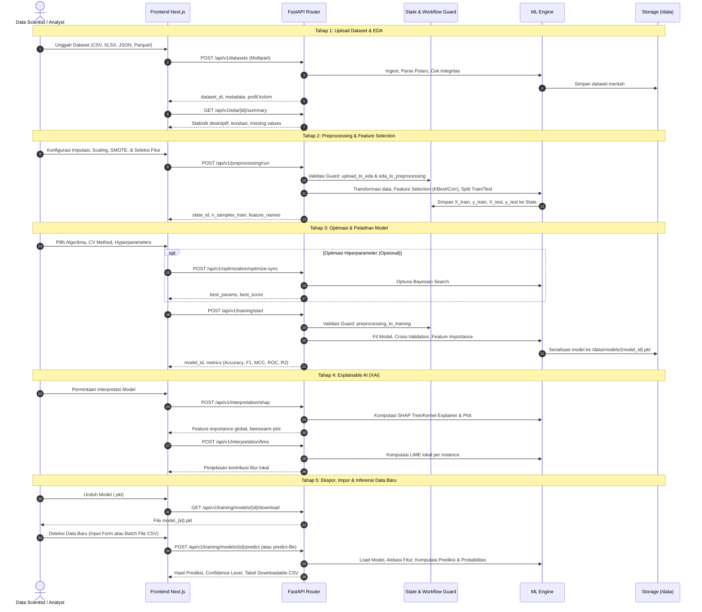
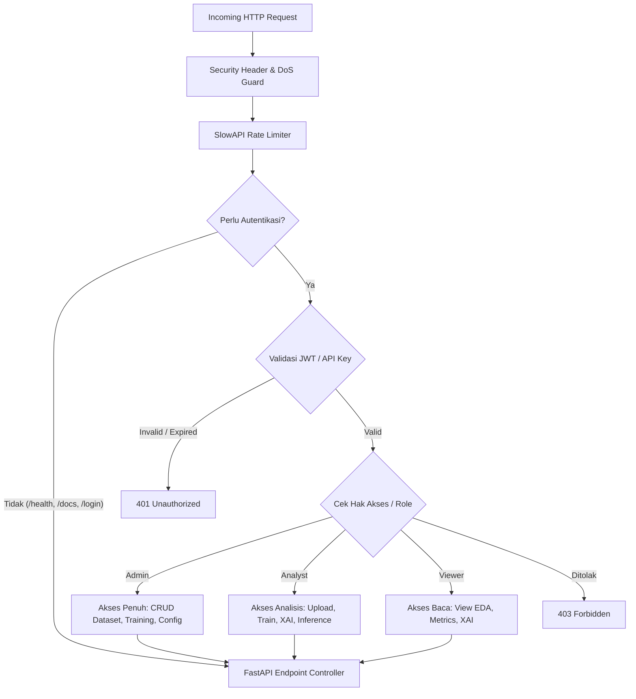

# 🏗️ Arsitektur & Spesifikasi Sistem Asmeranda AI

Dokumen ini menyajikan panduan arsitektur teknis menyeluruh, topologi komponen, alur data (*dataflow*), manajemen *state*, model keamanan, dan siklus hidup komputasi platform **Asmeranda AI**.

---

## 📑 Daftar Isi
1. [Ringkasan Eksekutif & Prinsip Desain](#-ringkasan-eksekutif--prinsip-desain)
2. [Topologi Sistem & Arsitektur Jaringan](#-topologi-sistem--arsitektur-jaringan)
3. [Alur Kerja End-to-End (Data Science Lifecycle)](#-alur-kerja-end-to-end-data-science-lifecycle)
4. [Rincian Arsitektur Komponen](#-rincian-arsitektur-komponen)
   - [4.1 Frontend Layer (Next.js 14 App Router)](#41-frontend-layer-nextjs-14-app-router)
   - [4.2 API Gateway & Backend Layer (FastAPI)](#42-api-gateway--backend-layer-fastapi)
   - [4.3 ML Engine & Computational Services](#43-ml-engine--computational-services)
   - [4.4 Explainable AI (XAI) Engine](#44-explainable-ai-xai-engine)
   - [4.5 Inference & Serialized Model Engine](#45-inference--serialized-model-engine)
5. [Manajemen State & Alur Validasi Workflow](#-manajemen-state--alur-validasi-workflow)
6. [Arsitektur Keamanan & RBAC](#-arsitektur-keamanan--rbac)
7. [Struktur Penyimpanan & Data Layer](#-struktur-penyimpanan--data-layer)
8. [Matriks Pengujian & Jaminan Kualitas (QA)](#-matriks-pengujian--jaminan-kualitas-qa)

---

## 🎯 Ringkasan Eksekutif & Prinsip Desain

**Asmeranda AI** adalah platform machine learning modular enterprise yang mengintegrasikan seluruh tahapan *data science lifecycle* ke dalam sistem terpadu:
- **Modular & Decoupled**: Antara lapisan UI/Frontend (Next.js 14), API Orchestrator (FastAPI), dan ML Engine (Python Data Science Ecosystem) terpisah secara bersih via REST API standar dan WebSocket streaming.
- **State-Driven Workflow**: Setiap tahapan (*Upload ➔ EDA ➔ Preprocessing ➔ Optimization ➔ Training ➔ XAI ➔ Inference*) dikendalikan oleh *State Transition Guard* yang mencegah kondisi balapan (*race condition*) atau eksekusi tidak valid.
- **High-Performance Data Processing**: Menggunakan Polars dan PyArrow untuk ingest dataset kecepatan tinggi, dikombinasikan dengan Pandas dan NumPy untuk pemrosesan fiturisasi.
- **Zero-Lock-in Artifact Serialization**: Model terlatih diekspor dalam format standar `.pkl` yang dapat diunduh, dijalankan di luar platform, atau diunggah kembali ke sistem untuk inferensi baru.

---

## 🌐 Topologi Sistem & Arsitektur Jaringan



---

## 🔄 Alur Kerja End-to-End (Data Science Lifecycle)

Alur kerja didesain secara sekuensial dengan validasi transisi otomatis pada setiap gerbang (*workflow gates*):



---

## 🧩 Rincian Arsitektur Komponen

### 4.1 Frontend Layer (Next.js 14 App Router)
- **Teknologi**: Next.js 14, React 18, Zustand, Vanilla CSS Design System.
- **Manajemen State Klien**:
  - `useWorkflow` (Zustand) dengan persistensi `localStorage` untuk menjaga konsistensi state saat navigasi antar-halaman.
  - `canProceedTo(step)` mengevaluasi prasyarat langkah secara dinamis untuk mengaktifkan/menonaktifkan link pada Sidebar.
- **Rute Aplikasi**:
  - `/data-upload`: Manajemen upload file dan inspeksi dataset awal.
  - `/eda`: Ringkasan statistik, heatmap korelasi matriks, dan distribusi data.
  - `/preprocessing`: Konfigurasi *cleaning*, *encoding*, *scaling*, *SMOTE/ADASYN*, dan *feature selection*.
  - `/optimization`: Tuning hiperparameter interaktif dengan Bayesian Optuna / Grid Search / Random Search.
  - `/training`: Pelatihan 12+ model supervised, CV diagnostik, kurva *learning curve*, komparasi leaderboard, dan download `.pkl`.
  - `/shap` & `/lime`: Dasbor Explainable AI untuk audit keputusan model.
  - `/inference`: Pusat deteksi data baru (formulir interaktif & batch file detection).
  - `/clustering`: Analisis clustering unsupervised (K-Means, HDBSCAN, Optimal-K).
  - `/timeseries`: Peramalan deret waktu dan deteksi anomali temporal.
  - `/advanced-ml`: Suite ML lanjutan (UMAP, PCA, t-SNE, Outlier Detection).

### 4.2 API Gateway & Backend Layer (FastAPI)
- **Teknologi**: FastAPI, Starlette, Pydantic v2, Uvicorn, SlowAPI.
- **Middleware Stack**:
  1. `SecurityHeadersMiddleware`: Injeksi header keamanan (CSP, X-Frame-Options, X-Content-Type-Options, HSTS).
  2. `SlowAPIRateLimiter`: Pembatasan laju permintaan untuk mencegah DoS/brute force.
  3. `ExceptionHandlingMiddleware`: Penangkapan global exception dengan format respons terstandar JSON.
  4. `AuditLoggerMiddleware`: Pencatatan terstruktur terhadap aktivitas autentikasi, upload file, dan eksekusi pelatihan model.

### 4.3 ML Engine & Computational Services
- **Data Engine**: `Polars` (zero-copy parsing dataset) & `Pandas`/`NumPy` (manipulasi tabular).
- **Supervised ML Suite**:
  - *Tree-based*: RandomForest, GradientBoosting, DecisionTree, XGBoost, LightGBM, CatBoost.
  - *Linear & Distance*: LogisticRegression, LinearRegression, SVM (SVC/SVR), KNeighbors.
  - *Ensembles*: Voting Classifier/Regressor (Hard/Soft), Stacking Classifier/Regressor.
- **Validasi Silang (Cross-Validation)**:
  - Stratified K-Fold (seimbang untuk kelas minoritas).
  - K-Fold standar.
  - Time Series Split (deret waktu temporal).
  - Leave-One-Out (dataset berukuran mikro).
  - Train-Test Holdout.
- **Metrik Evaluasi Mendalam**:
  - *Klasifikasi*: Accuracy, Balanced Accuracy, F1 Macro/Micro/Weighted, MCC (Matthews Correlation Coefficient), Precision, Recall, ROC-AUC, PR Curve, Confusion Matrix.
  - *Regresi*: R² Score, RMSE, MAE, MSE, MAPE.

### 4.4 Explainable AI (XAI) Engine
- **SHAP (SHapley Additive exPlanations)**:
  - Otomatis memilih explainer yang optimal (`TreeExplainer` untuk model berbasis pohon, `LinearExplainer` untuk model linear, atau `KernelExplainer` untuk black-box estimator).
  - Visualisasi global summary feature importance dalam representasi Matplotlib yang di-render ke base64 string.
- **LIME (Local Interpretable Model-agnostic Explanations)**:
  - Penjelasan lokal tabular per baris observasi (`LimeTabularExplainer`).
  - Menguraikan kontribusi bobot setiap fitur spesifik terhadap probabilitas prediksi kelas.

### 4.5 Inference & Serialized Model Engine
- **Struktur Artefak Model**:
  ```python
  payload = {
      "model": fitted_estimator_object,
      "model_type": "RandomForest",
      "problem_type": "Classification",
      "feature_names": ["age", "income", "credit_score", ...],
      "metrics": {...},
      "cv_report": {...},
      "feature_importances": [...],
      "original_filename": "model_abc123.pkl"
  }
  ```
- **Fitur Inferensi**:
  - **Auto Feature Alignment**: Otomatis mendeteksi fitur yang hilang pada input baru dan mengisi nilai default numerik (0.0) tanpa menyebabkan *shape mismatch error*.
  - **Batch File Detection**: Menerima file CSV/XLSX baru, menjalankan vektorisasi prediksi, menyertakan kolom skor probabilitas (*confidence*), dan mengekspor hasilnya.
  - **Model Portability**: File `.pkl` yang diunduh dapat langsung dimuat di lingkungan Python eksternal maupun diunggah kembali ke sistem.

---

## 🔒 Arsitektur Keamanan & RBAC



### Aturan Keamanan Utama:
1. **Validasi File Upload**: Memeriksa ukuran maksimum, ekstensi yang diizinkan (`.csv`, `.xlsx`, `.json`, `.parquet`, `.pkl`), dan menolak binary executable berbahaya (`MZ` / `\x7fELF` magic bytes).
2. **Sanitasi Input**: Mencegah serangan *SQL Injection*, *Cross-Site Scripting (XSS)*, dan *Path Traversal* pada parameter nama file atau ID query.
3. **Audit Logging**: Jejak audit keamanan tercatat terstruktur di `security_audit.log` mencakup alamat IP, jenis event, dan status keberhasilan.

---

## 💾 Struktur Penyimpanan & Data Layer

```text
c:\asmeranda-modular\
├── backend/
│   ├── api/v1/                   # Endpoint controller layer
│   │   ├── datasets.py           # Ingestion & dataset controller
│   │   ├── eda.py                # Exploratory data analysis controller
│   │   ├── preprocessing.py      # Data cleaning & transformation controller
│   │   ├── training.py           # Training, job tracker & inference controller
│   │   ├── interpretation.py     # SHAP & LIME controller
│   │   ├── optimization.py       # Optuna Bayesian tuner controller
│   │   ├── clustering.py         # Unsupervised clustering controller
│   │   ├── timeseries.py         # Forecasting & temporal anomaly controller
│   │   ├── advanced_ml.py        # Dimensionality reduction (UMAP/PCA)
│   │   └── auth.py               # Token & login controller
│   ├── core/                     # Fondasi keamanan, state, & konfigurasi
│   │   ├── state.py              # In-memory workflow state store
│   │   ├── auth.py               # JWT & RBAC implementation
│   │   ├── security_utils.py     # Input sanitizer & XSS protection
│   │   ├── security_audit.py     # Structured security logger
│   │   └── config.py             # App & environment configuration
│   ├── schemas/                  # Pydantic v2 data transfer objects (DTO)
│   └── services/                 # Komputasi algoritma data science
│       ├── dataset_service.py
│       ├── preprocessing_service.py
│       ├── training_service.py
│       ├── evaluation_service.py
│       ├── interpretation_service.py
│       └── optimization_service.py
├── frontend/
│   ├── app/                      # Next.js 14 App Router Pages
│   │   ├── data-upload/          # Upload data page
│   │   ├── eda/                  # EDA dashboard
│   │   ├── preprocessing/        # Preprocessing & feature selection
│   │   ├── optimization/         # Hyperparameter tuning page
│   │   ├── training/             # Supervised training & benchmark
│   │   ├── shap/                 # SHAP XAI page
│   │   ├── lime/                 # LIME XAI page
│   │   ├── inference/            # New data detection & prediction page
│   │   ├── clustering/           # Clustering analysis page
│   │   ├── timeseries/           # Time series forecasting page
│   │   └── advanced-ml/          # Advanced ML suite page
│   ├── components/               # Navigasi & layout components
│   └── lib/                      # Zustand store, API client, & i18n dict
├── data/                         # Direktori penyimpanan terisolasi
│   ├── datasets/                 # File dataset mentah yang diunggah
│   ├── models/                   # Artefak model terlatih (.pkl)
│   └── states/                   # Cache metadata state
└── workflow_validator.py         # State machine & transition rule engine
```

---

## 🧪 Matriks Pengujian & Jaminan Kualitas (QA)

Pengujian dilakukan secara otomatis menggunakan `pytest` dengan cakupan verifikasi:

| Kategori Pengujian | Modul Uji | Jumlah Test | Status |
|---|---|:---:|:---:|
| **Security & RBAC** | `test_security.py` | 22 | ✅ PASS |
| **API Endpoints & Integration** | `test_api_endpoints.py` | 23 | ✅ PASS |
| **Workflow State Transitions** | `test_workflow_validator.py` | 16 | ✅ PASS |
| **Optimal Pipeline Archetypes** | `test_optimal_pipeline_e2e.py` | 8 | ✅ PASS |
| **State Storage & Isolation** | `test_core_state.py` | 17 | ✅ PASS |
| **Data Utilities & Cleansing** | `test_data_utils.py` | 28 | ✅ PASS |
| **Error Handling & Resilience**| `test_error_handler.py` | 16 | ✅ PASS |
| **Full E2E QA Lifecycle** | `test_full_qa_e2e_workflow.py` | 1 | ✅ PASS |
| **Frontend Production Build** | Next.js Static Optimization | 17 Rute | ✅ PASS |

---
*Dokumen Arsitektur Resmi — Asmeranda AI Platform v2.0*  
*Terakhir diperbarui: 28 Agustus 2026*
