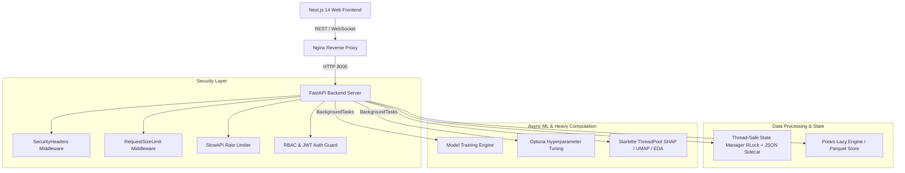

# Asmeranda AI

An enterprise-grade modular machine learning platform delivering end-to-end data science workflows: high-throughput dataset ingestion, exploratory data analysis (EDA), automated feature engineering, supervised/unsupervised model training, Optuna hyperparameter optimization, explainable AI (SHAP & LIME), time series forecasting, and role-based security hardening.

---

## 🚀 Key Features

### 🔐 Security & Access Control (RBAC)
- **Role-Based Access Control (RBAC)**: Enforces access tiers (`Admin`, `Analyst`, `Viewer`).
- **JWT & API Key Authentication**: Cryptographically signed access tokens and high-entropy service API keys.
- **Password Strength Policy**: Minimum length, uppercase, lowercase, numeric, and special character enforcement.
- **Security Middlewares**:
  - `SecurityHeadersMiddleware`: Injects `X-Content-Type-Options`, `X-Frame-Options`, `X-XSS-Protection`, `CSP`, and `HSTS`.
  - `RequestSizeLimitMiddleware`: Payload size restrictions against HTTP 413 Denial-of-Service.
- **Rate Limiting**: Endpoint-level rate limiting powered by SlowAPI.
- **Audit Logging**: Structured JSON security trail (`security_audit.log`) tracking authentication, training invocations, and policy violations.

### 🧠 Core Machine Learning & Auto-Optimization
- **Supervised Learning**: 9+ built-in algorithms (RandomForest, XGBoost, LightGBM, CatBoost, GradientBoosting, SVM, DecisionTree, KNN, Logistic/Linear Regression).
- **Validation Schemes**: K-Fold, Stratified K-Fold, Leave-One-Out, and Time-Series Splits.
- **Automated Hyperparameter Optimization**: Grid Search, Random Search, and Bayesian Optimization via Optuna.
- **Smart Recommendations**: Rule-based algorithm selection and preprocessing presets tailored to data shape.
- **Comprehensive Evaluation**: ROC-AUC, PR Curves, Confusion Matrices, MCC, MAPE, Balanced Accuracy, and Learning Curves.

### 🔍 Unsupervised Learning & Dimensionality Reduction
- **Clustering**: KMeans, DBSCAN, Hierarchical, Spectral, and HDBSCAN.
- **Cluster Diagnostics**: Automated Elbow method and Silhouette score evaluation for Optimal-K detection.
- **Dimensionality Reduction**: 2D/3D projection using UMAP and PCA.

### 💡 Explainable AI (XAI)
- **SHAP (SHapley Additive exPlanations)**: TreeExplainer, LinearExplainer, and KernelExplainer with feature importance summary.
- **LIME (Local Interpretable Model-agnostic Explanations)**: Local tabular prediction explanations.

### 📈 Time Series & Anomaly Detection
- **Time Series Forecasting**: ARIMA, SARIMA, Prophet, LSTM, and moving averages with automated frequency inference.
- **Anomaly Detection**: Tabular and temporal anomaly detection using Isolation Forest and One-Class SVM.

### ⚡ High-Throughput Data Ingestion & Preprocessing
- **Polars Engine**: Lightning-fast columnar parsing, SIMD vectorization, and LazyFrame parquet scanning.
- **Feature Engineering Pipeline**: Smart type inference, missing value imputation, robust outlier filtering, categorical encoding, and multi-mode scalers.

---

## 🏗️ System Architecture & Workflow



### 🏎️ Performance Optimizations & Bottleneck Prevention
1. **Lazy Columnar Ingestion**: Large dataset previews use `polars.scan_parquet().slice().collect()` to prevent in-memory duplication and high memory peaks.
2. **Non-Blocking Background Tasks**: Intensive compute tasks (Model Training, Bayesian Tuning) run asynchronously via FastAPI `BackgroundTasks`, keeping API request latency low.
3. **Parquet Columnar Persistence**: Ingested datasets are saved as Parquet with JSON metadata sidecars, delivering 5-10x compression and fast random access.
4. **State Isolation**: Concurrent user sessions are isolated via unique `state_id` tokens with thread-safe `RLock` synchronization.
5. **Sample Capping for XAI**: Computationally heavy operations (SHAP, LIME, UMAP) apply controlled sampling (`max_samples`) to prevent thread pool starvation.

---

## 🛠️ Technology Stack

| Layer | Technologies |
|---|---|
| **Backend API** | FastAPI, Pydantic v2, Uvicorn, Starlette, SlowAPI |
| **Data Engine** | Polars, Pandas, PyArrow, NumPy |
| **Machine Learning** | scikit-learn, XGBoost, LightGBM, CatBoost, Optuna, statsmodels |
| **Explainable AI** | SHAP, LIME |
| **Security & Auth** | PyJWT, Direct Bcrypt, Python Secrets, SQLite Store |
| **Frontend UI** | Next.js 14 (App Router), React 18, Zustand, Custom CSS Design System |
| **Infra & DevOps** | Docker, Docker Compose, Nginx, Azure Container Apps, AWS, GCP |

---

## 📦 Installation & Quickstart

### Prerequisites
- **Python 3.11+**
- **Node.js 18+** & `npm`
- **Docker Desktop** (optional for containerized setup)

---

### Local Development Setup

#### 1. Backend Service
```bash
# Navigate to workspace root
cd asmeranda-modular

# Create and activate virtual environment
python -m venv .venv
# On Windows:
.\.venv\Scripts\activate
# On Linux/macOS:
# source .venv/bin/activate

# Install backend dependencies
pip install -r backend/requirements-backend.txt

# Setup environment configuration
cp .env.example .env

# Run FastAPI backend with Uvicorn
python -m uvicorn backend.main:app --host 0.0.0.0 --port 8000 --reload
```

#### 2. Frontend Application
```bash
# In a separate terminal, navigate to frontend
cd frontend

# Install Node dependencies
npm install

# Start Next.js development server
npm run dev
```

---

### Access Points & Default Credentials

- **Frontend App**: [http://localhost:3000](http://localhost:3000)
- **Backend API**: [http://localhost:8000](http://localhost:8000)
- **Swagger Documentation**: [http://localhost:8000/docs](http://localhost:8000/docs)
- **ReDoc API Reference**: [http://localhost:8000/redoc](http://localhost:8000/redoc)

| Account | Username | Password | Role |
|---|---|---|---|
| **System Admin** | `admin` | `Admin@Asmeranda2026!` | `admin` |

---

## 🐳 Docker Deployment

To build and run the multi-container stack with Docker Compose:

```bash
# Build and start services (Backend, Frontend, Nginx proxy)
docker compose up --build -d

# Inspect running containers
docker compose ps

# View service logs
docker compose logs -f

# Teardown stack
docker compose down
```

---

## 📊 API Reference

| Endpoint Prefix | Method | Description |
|---|---|---|
| `/api/v1/auth/login` | `POST` | User authentication & JWT access token issuance |
| `/api/v1/auth/register` | `POST` | User registration with password policy validation |
| `/api/v1/auth/me` | `GET` | Retrieve profile and assigned roles |
| `/api/v1/datasets/upload` | `POST` | Upload and ingest datasets (CSV, XLSX, Parquet, JSON) |
| `/api/v1/datasets/list` | `GET` | List all ingested datasets |
| `/api/v1/datasets/{id}/preview`| `GET` | Paginated dataset preview via Polars LazyFrame |
| `/api/v1/eda/summary` | `POST` | Descriptive statistics, data types & missing value audit |
| `/api/v1/preprocessing/run` | `POST` | Execute imputation, scaling, and train-test splitting |
| `/api/v1/preprocessing/cluster`| `POST` | Run unsupervised clustering (KMeans, DBSCAN, etc.) |
| `/api/v1/training/start` | `POST` | Asynchronous model training dispatch |
| `/api/v1/training/models` | `GET` | Retrieve list and metrics of trained models |
| `/api/v1/training/evaluate` | `POST` | Comprehensive performance metrics and confusion matrices |
| `/api/v1/optimization/hyperparameters` | `POST` | Bayesian optimization with Optuna |
| `/api/v1/interpretation/shap` | `POST` | Global feature attribution calculation |
| `/api/v1/interpretation/lime` | `POST` | Local instance explanation |
| `/api/v1/timeseries/forecast` | `POST` | Time-series modeling & future period forecasting |
| `/api/v1/advanced-ml/umap` | `POST` | High-dimensional data projection via UMAP |
| `/health` | `GET` | Service liveness probe |

---

## 🧪 Testing & Verification

```bash
# Run complete test suite
pytest

# Run security test suite
pytest backend/tests/security/ -v

# Run with code coverage report
pytest --cov=backend --cov-report=term-missing

# Run end-to-end system verification
python final_verification.py
```

---

## ☁️ Cloud Deployment

- **Azure Container Apps**: Run `deploy-to-azure.bat` (Windows) or `./deploy-to-azure.sh` (Linux).
- **AWS**: Run `./deploy-cloud-aws.sh`.
- **GCP**: Run `./deploy-cloud-gcp.sh`.

---

## 📝 License & Maintainer

Proprietary software developed by **PT. Asmer Sahabat Sukses**.

- **Support**: support@asmeranda.ai
- **Interactive Documentation**: `/docs`

© 2024–2026 PT. Asmer Sahabat Sukses. All rights reserved.