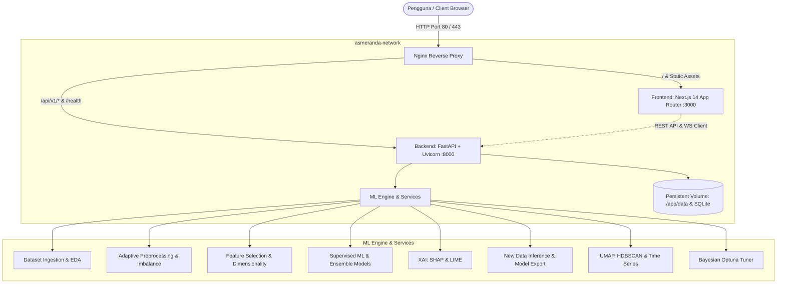
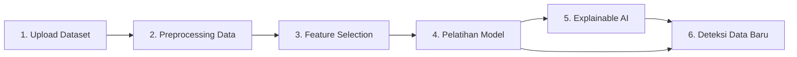
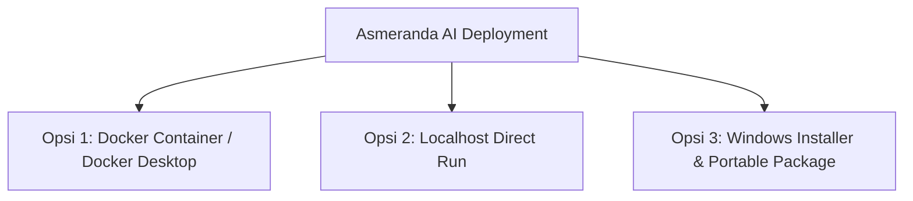

# Asmeranda AI

Platform machine learning modular berbasis enterprise untuk workflow data science *end-to-end*. Mulai dari upload dataset, eksplorasi data (EDA), preprocessing adaptif, feature selection, pelatihan model, optimasi hyperparameter, interpretasi model (Explainable AI: SHAP & LIME), hingga inferensi deteksi data baru dengan model yang telah di-download/diekspor — semua dalam satu platform terintegrasi dengan keamanan berbasis peran (RBAC).

> 📘 **Dokumentasi Lengkap Arsitektur**: Silakan baca [`ARSITEKTUR ASMERANDA.md`](file:///c:/asmeranda-modular/ARSITEKTUR%20ASMERANDA.md) untuk rincian mendalam mengenai topologi sistem, alur data (*dataflow*), siklus hidup *state*, dan model keamanan.

---

## 🏗️ Arsitektur Sistem & Topologi Docker



---

## 🚀 Alur Kerja 6 Tahap Utama (*End-to-End Workflow*)

Platform ini mendukung siklus machine learning lengkap tanpa dependensi eksternal:



1. **📂 1. Upload Dataset & Eksplorasi Data (EDA)**:
   - Mendukung format **CSV**, **Excel (.xlsx, .xls)**, **JSON**, dan **Parquet**.
   - Validasi keamanan otomatis (deteksi konten executable terlarang seperti header MZ/ELF).
   - Inferensi tipe data otomatis (numerik, kategorik, temporal, teks), analisis statistik deskriptif, missing values, dan visualisasi korelasi matriks.

2. **⚙️ 2. Data Preprocessing Adaptif**:
   - **Imputasi Nilai Hilang**: Mean, median, most frequent (modus), konstanta, atau drop rows.
   - **Pembersihan Outlier**: Statistik IQR, Z-Score, Winsorization, atau pemangkasan.
   - **Encoding Kategorikal**: One-Hot Encoding otomatis & Label Encoding.
   - **Feature Scaling**: Standard Scaler, MinMax Scaler, Robust Scaler (kebal pencilan), Power Transformer, dan Quantile Transformer.
   - **Penanganan Ketidakseimbangan (Imbalance Dataset)**: SMOTE, ADASYN, Random Oversampling, dan Undersampling.

3. **🎯 3. Feature Selection (Seleksi Fitur Cerdas)**:
   - Metode **SelectKBest** (ANOVA F-Score / Mutual Information).
   - Filter Korelasi multikolinieritas (*Correlation Thresholding*).
   - Ambang Batas Variansi (*Variance Threshold*).
   - *Recursive Feature Elimination* (RFE) berbasis model dengan percepatan paralel.

4. **🧠 4. Pelatihan Model Machine Learning Supervised**:
   - **12+ Algoritma Lengkap**: RandomForest, GradientBoosting, XGBoost, LightGBM, CatBoost, SVM (SVC/SVR), DecisionTree, K-Nearest Neighbors (KNN), Logistic/Linear Regression, Voting Ensemble (Hard/Soft), dan Stacking Ensemble.
   - **Validasi Silang (Cross-Validation)**: Stratified K-Fold (seimbang untuk minoritas), K-Fold standar, Leave-One-Out, Time Series Split, dan Train-Test holdout.
   - **Evaluasi & Diagnostik Lengkap**: Accuracy, Balanced Accuracy, F1 Macro/Micro/Weighted, MCC, ROC-AUC, PR Curve, Confusion Matrix interaktif, serta kurva *Learning Curve* (analisis *bias vs variance / underfitting vs overfitting*).
   - **Model Comparison Leaderboard**: Pengujian otomatis seluruh algoritma dalam 1-klik untuk menentukan model berkinerja terbaik.
   - **Optimasi Hiperparameter Terintegrasi**: Sinkronisasi 1-klik dengan modul Optuna Bayesian Search, Grid Search, dan Random Search.

5. **📊 5. Explainable AI (XAI)**:
   - **SHAP (SHapley Additive exPlanations)**: Analisis kontribusi fitur global berbasis `TreeExplainer`, `LinearExplainer`, dan `KernelExplainer` lengkap dengan grafik beeswarm dan rangkuman kepentingan fitur.
   - **LIME (Local Interpretable Model-agnostic Explanations)**: Penjelasan prediksi lokal granular per observasi data tabular.

6. **🔮 6. Deteksi & Inferensi Data Baru (Model Export & Prediction)**:
   - **Ekspor Artefak Model**: Download model terlatih dalam format standar ter-serialisasi (`.pkl`) untuk kebutuhan deployment mandiri.
   - **Impor Model Eksternal**: Unggah kembali file `.pkl` yang telah diunduh untuk inferensi instan.
   - **Mode 1 (Formulir Interaktif)**: Masukkan nilai fitur satu per satu pada antarmuka dinamis untuk memperoleh hasil prediksi dan skor probabilitas keyakinan (*confidence percentage*).
   - **Mode 2 (Deteksi Batch File)**: Drag-and-drop file CSV/Excel data baru yang belum pernah dilihat model, jalankan inferensi massal, tinjau tabel hasil, dan unduh data berlabel prediksi lengkap (`.csv`).

---

## 🛠️ Teknologi yang Digunakan

| Lapisan | Teknologi |
|---|---|
| **Backend API** | FastAPI, Pydantic v2, Uvicorn, Starlette, SlowAPI |
| **Engine Data** | Polars, Pandas, PyArrow, NumPy |
| **Machine Learning** | scikit-learn, XGBoost, LightGBM, CatBoost, Optuna, statsmodels |
| **Explainable AI** | SHAP, LIME |
| **Visualisasi & Plotting**| Matplotlib, Seaborn |
| **Keamanan & Auth** | PyJWT, Bcrypt, Cryptography, Passlib (RBAC: Admin, Analyst, Viewer) |
| **Frontend** | Next.js 14 (App Router), React 18, Zustand, Custom CSS Design System |
| **Infra & Container** | Docker, Docker Compose, Nginx (Alpine), Multi-stage build |

---

## 📦 3 Pilihan Metode Deployment Resmi

Asmeranda AI didesain untuk berjalan secara optimal, aman, dan mandiri (*self-hosted / on-premise*) melalui **3 opsi deployment**:



---

### 🐳 Opsi 1: Docker Container / Docker Desktop (Multi-Container)

Semua service (Backend FastAPI, Frontend Next.js, dan Nginx Reverse Proxy) telah dikemas dalam kontainer Docker terisolasi dengan healthcheck otomatis.

#### 1. Jalankan via Script 1-Klik (Windows):
- **Start**: Dobel klik file [`start_docker.bat`](file:///c:/asmeranda-modular/start_docker.bat) atau jalankan [`deploy-docker-desktop.ps1`](file:///c:/asmeranda-modular/deploy-docker-desktop.ps1).
- **Stop**: Dobel klik file [`stop_docker.bat`](file:///c:/asmeranda-modular/stop_docker.bat).

#### 2. Jalankan Manual via Terminal:
```bash
# Build dan jalankan seluruh kontainer di latar belakang
docker compose up --build -d

# Periksa status kontainer
docker compose ps

# Memantau log real-time
docker compose logs -f

# Menghentikan layanan
docker compose down
```

#### 3. Akses Layanan:
- **Aplikasi Web (via Nginx)**: [http://localhost](http://localhost) (Port 80)
- **Frontend UI Langsung**: [http://localhost:3000](http://localhost:3000)
- **Backend API**: [http://localhost:8000](http://localhost:8000)
- **Swagger Docs**: [http://localhost:8000/docs](http://localhost:8000/docs)

---

### 💻 Opsi 2: Localhost Development / Run (Native Python + Node.js)

Cocok untuk pengembangan lokal (*local development*), testing fitur baru, atau debugging langsung.

#### 1. Jalankan via Script 1-Klik (Windows):
- Dobel klik file [`run_local.bat`](file:///c:/asmeranda-modular/run_local.bat) atau jalankan [`run_local.ps1`](file:///c:/asmeranda-modular/run_local.ps1) di PowerShell.
- Skrip ini otomatis memeriksa Python, membuat virtual environment `.venv`, menginstal dependensi, dan menjalankan Backend & Frontend secara bersamaan.

#### 2. Jalankan di Linux / macOS / WSL:
```bash
chmod +x deploy-local.sh
./deploy-local.sh
```

#### 3. Jalankan Manual:
```bash
# Terminal 1 - Backend FastAPI
python -m venv .venv
.\.venv\Scripts\Activate.ps1
pip install -r backend/requirements-backend.txt
python -m uvicorn backend.main:app --host 127.0.0.1 --port 8000 --reload

# Terminal 2 - Frontend Next.js
cd frontend
npm install
npm run dev
```

---

### 🪟 Opsi 3: Windows Installer & Portable Package

Menyediakan paket instalasi mandiri untuk pengguna sistem operasi Windows tanpa perlu setup manual.

#### 1. Menyusun Installer (.exe) & Portable (.zip):
- Jalankan [`build_installer.bat`](file:///c:/asmeranda-modular/build_installer.bat).
- Skrip akan otomatis mengompilasi [`asmeranda.iss`](file:///c:/asmeranda-modular/asmeranda.iss) menggunakan Inno Setup Compiler menjadi installer `AsmerandaAI_Setup_v2.0.0.exe` serta membuat paket `AsmerandaAI-Portable-v2.0.0.zip` di folder `InstallerOutput\`.

#### 2. Menginstal di Komputer Klien Windows:
1. Jalankan `AsmerandaAI_Setup_v2.0.0.exe` sebagai Administrator.
2. Ikuti wizard instalasi standar hingga selesai.
3. Pintasan (*shortcut*) otomatis tersedia di Desktop dan Start Menu untuk menjalankan aplikasi.

---

## 🔐 Autentikasi, Keamanan & Kredensial Pengujian

Asmeranda AI menerapkan sistem autentikasi **JSON Web Token (JWT)** terintegrasi dengan **Role-Based Access Control (RBAC)** dan enkripsi kata sandi menggunakan standard industri **Bcrypt** (12 rounds).

### 🔑 Kredensial Bawaan untuk Pengujian (Testing Credentials)

| Akun | Username | Password Default | Role | Hak Akses Utama |
|---|---|---|---|---|
| **Administrator** | `admin` | `Admin@Asmeranda2026!` | `admin` | Akses penuh (Upload, Training, Evaluasi, Delete Model, Manajemen User) |

> 💡 **Login Cepat**: Pada halaman `/login`, tersedia tombol **"Gunakan Akun Default (admin)"** untuk mengisi form login secara instan dalam 1-klik saat pengujian.

---

### 🛡️ Matriks Hak Akses (Role-Based Access Control / RBAC)

| Modul / Tindakan | `admin` | `analyst` | `viewer` |
|---|:---:|:---:|:---:|
| **Upload Dataset & EDA** | ✅ | ✅ | ❌ (Hanya View EDA) |
| **Preprocessing & Feature Selection** | ✅ | ✅ | ❌ |
| **Optimasi & Pelatihan Model** | ✅ | ✅ | ❌ |
| **Explainable AI (SHAP & LIME)** | ✅ | ✅ | ✅ (Read-Only) |
| **Inferensi & Batch Prediction** | ✅ | ✅ | ✅ |
| **Download Artefak Model (.pkl)** | ✅ | ✅ | ✅ |
| **Hapus Dataset / Model** | ✅ | ❌ | ❌ |
| **Registrasi Pengguna Baru** | ✅ | ❌ | ❌ |

---

### ⚙️ Konfigurasi Autentikasi di Backend (`.env`)

Sistem mendukung fleksibilitas mode autentikasi melalui environment variable:

```env
# Mengaktifkan verifikasi JWT ketat pada seluruh endpoint API (Production)
ASMERANDA_REQUIRE_AUTH=true

# Secret key untuk signing token JWT (Wajib diganti pada deployment produksi)
ASMERANDA_JWT_SECRET=rahasia-kunci-jwt-yang-panjang-dan-acak-2026

# Masa berlaku token JWT (dalam menit, default: 1440 = 24 jam)
ASMERANDA_JWT_EXPIRE_MINUTES=1440
```

- **Mode Standar / Dev**: `ASMERANDA_REQUIRE_AUTH=false` (Autentikasi opsional untuk mempermudah automated unit testing).
- **Mode Produksi / Strict**: `ASMERANDA_REQUIRE_AUTH=true` atau `ASMERANDA_PRODUCTION_MODE=true` (Seluruh endpoint wajib menyertakan token `Bearer <jwt_token>`).

---

## 📊 Referensi Endpoint API Utama

| Endpoint | Metode | Deskripsi |
|---|---|---|
| `/health` | `GET` | Cek status kesehatan sistem & versi runtime |
| `/docs` | `GET` | Dokumentasi interaktif Swagger UI |
| `/api/v1/auth/login` | `POST` | Login autentikasi & penerbitan token JWT |
| `/api/v1/datasets` | `POST` | Upload dataset (CSV, XLSX, Parquet, JSON) |
| `/api/v1/datasets` | `GET` | Daftar semua dataset yang tersimpan |
| `/api/v1/eda/{id}/summary` | `GET` | Statistik deskriptif & analisis missing values |
| `/api/v1/preprocessing/run` | `POST` | Eksekusi pipeline preprocessing & feature selection |
| `/api/v1/clustering/cluster` | `POST` | Analisis clustering unsupervised |
| `/api/v1/clustering/optimal-k`| `POST` | Analisis Elbow & Silhouette Score |
| `/api/v1/optimization/optimize` | `POST` | Hyperparameter tuning dengan Optuna Bayesian search |
| `/api/v1/training/start` | `POST` | Memulai training model ML dengan job tracking |
| `/api/v1/training/compare` | `POST` | Benchmark dan komparasi otomatis seluruh model |
| `/api/v1/training/learning-curve` | `POST` | Pembuatan grafik diagnostik kurva pembelajaran |
| `/api/v1/training/models/{id}/download` | `GET` | Download artefak model serialisasi (`.pkl`) |
| `/api/v1/training/models/upload` | `POST` | Upload dan registrasi file model (`.pkl`) eksternal |
| `/api/v1/training/models/{id}/predict` | `POST` | Inferensi prediksi interaktif pada input record baru |
| `/api/v1/training/models/{id}/predict-file` | `POST` | Inferensi batch langsung dari file CSV/Excel data baru |
| `/api/v1/interpretation/shap` | `POST` | Kalkulasi global & local feature importance (SHAP) |
| `/api/v1/interpretation/lime` | `POST` | Penjelasan lokal prediksi per instance data (LIME) |
| `/api/v1/timeseries/{id}/forecast` | `GET` | Pelatihan model forecasting deret waktu |
| `/api/v1/ws/{channel_id}` | `WS` | WebSocket multi-channel untuk streaming status progress |

---

## 🧪 Testing & Jaminan Kualitas (QA Verification)

Sistem telah diuji secara komprehensif dengan **131 Automated Tests** yang mencakup pengujian unit, integrasi, keamanan, dan end-to-end lifecycle.

```bash
# Menjalankan seluruh test suite backend (Unit, Integration, Security, E2E)
python -m pytest backend/tests/ -v --no-cov

# Menjalankan test validator alur kerja
python -m pytest backend/tests/unit/test_workflow_validator.py -v

# Menjalankan verifikasi kompilasi frontend Next.js
cd frontend && npm run build
```

---

## 📁 Struktur Direktori Bersih

```text
asmeranda-modular/
├── backend/                  # Source code Backend (FastAPI)
│   ├── api/v1/               # Endpoint REST API v1
│   ├── core/                 # Auth, Security, Config, State Management
│   ├── services/             # Core ML, EDA, XAI, Preprocessing services
│   ├── schemas/              # Pydantic schemas (request/response)
│   ├── tests/                # Test suite komprehensif (Unit, Security, Integration)
│   ├── Dockerfile            # Container definition untuk backend
│   └── requirements-backend.txt # Backend runtime dependencies
├── frontend/                 # Source code Frontend (Next.js 14 App Router)
│   ├── app/                  # Next.js pages & routes
│   │   ├── login/            # Halaman login & otentikasi JWT
│   │   ├── data-upload/      # Upload data
│   │   ├── eda/              # Eksplorasi data
│   │   ├── preprocessing/    # Preprocessing & Feature selection
│   │   ├── optimization/     # Optimasi hiperparameter
│   │   ├── training/         # Pelatihan model & benchmark
│   │   ├── shap/             # Interpretasi SHAP
│   │   ├── lime/             # Interpretasi LIME
│   │   ├── inference/        # Deteksi data baru & model prediction
│   │   ├── clustering/       # Clustering analysis
│   │   ├── timeseries/       # Time series & forecasting
│   │   └── advanced-ml/      # Advanced ML suite
│   ├── components/           # UI Components (Sidebar, AuthGuard, MainLayout)
│   ├── lib/                  # Store (Workflow & Auth Zustand), API client, i18n
│   ├── Dockerfile            # Container definition untuk frontend
│   └── package.json          # Node dependencies & scripts
├── nginx/                    # Konfigurasi reverse proxy Nginx
├── data/                     # Direktori penyimpanan dataset & model (.pkl)
├── docker-compose.yml        # Multi-container orchestration (Opsi 1)
├── start_docker.bat          # 1-klik start Docker Desktop (Opsi 1)
├── stop_docker.bat           # 1-klik stop Docker Desktop (Opsi 1)
├── deploy-docker-desktop.ps1 # PowerShell launcher Docker Desktop (Opsi 1)
├── run_local.bat             # 1-klik start Localhost Windows CMD (Opsi 2)
├── run_local.ps1             # 1-klik start Localhost PowerShell (Opsi 2)
├── deploy-local.sh           # Shell script start Localhost Unix (Opsi 2)
├── asmeranda.iss             # Inno Setup Windows installer script (Opsi 3)
├── build_installer.bat       # Builder Windows installer & ZIP (Opsi 3)
├── workflow_validator.py     # Validator alur transisi state ML
├── ARSITEKTUR ASMERANDA.md   # Dokumentasi arsitektur sistem lengkap
└── README.md                 # Dokumentasi proyek
```

---

## 📝 Lisensi & Hak Cipta

Perangkat lunak proprietary milik **PT. Asmer Sahabat Sukses**.

- **Email**: support@asmeranda.ai
- **Dokumentasi Interaktif**: Akses `http://localhost:8000/docs` setelah server berjalan

---

**Asmeranda AI — Platform Machine Learning Modular End-to-End**  
© 2024–2026 PT. Asmer Sahabat Sukses. Seluruh hak dilindungi undang-undang.