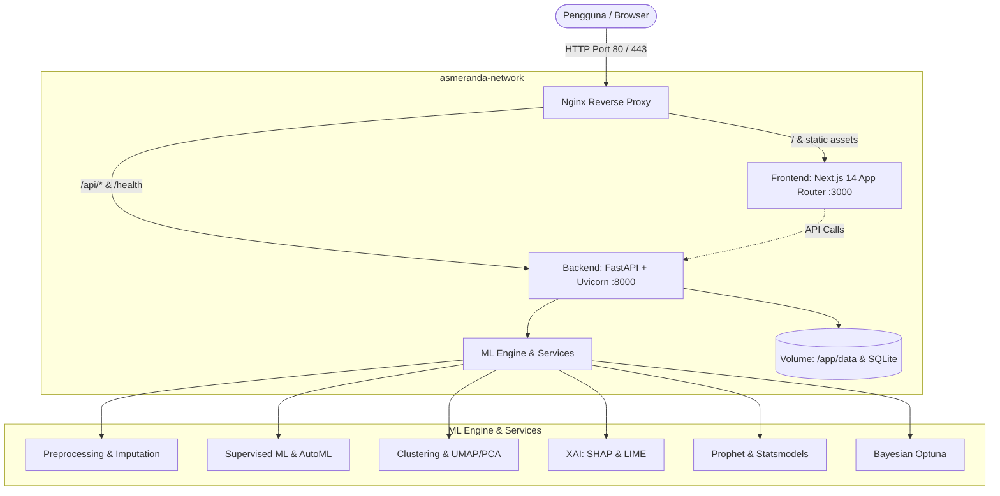
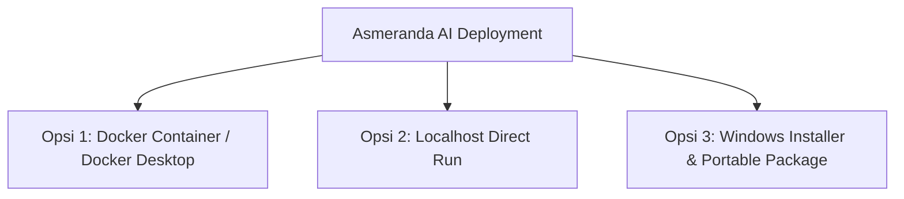

# Asmeranda AI

Platform machine learning modular berbasis enterprise untuk workflow data science *end-to-end*. Mulai dari upload dataset, eksplorasi data (EDA), preprocessing adaptif, pelatihan model, optimasi hyperparameter, interpretasi model (XAI), hingga deteksi anomali dan forecasting deret waktu — semua dalam satu platform terintegrasi dengan keamanan berbasis peran (RBAC).

---

## 🏗️ Arsitektur Sistem & Topologi Docker



---

## 🚀 Fitur Utama

### 🔐 Keamanan & Kontrol Akses
- **RBAC (Role-Based Access Control)**: Tiga tingkat akses — `Admin`, `Analyst`, dan `Viewer`.
- **JWT & API Key**: Token sesi terenkripsi AES-256/GCM dan kunci API layanan.
- **Validasi Password**: Aturan kompleksitas ketat (huruf besar, kecil, angka, simbol, panjang minimum).
- **Security Middleware**: Header keamanan HTTP (CSP, HSTS, X-Frame-Options), proteksi DoS, dan rate limiting adaptif via SlowAPI.
- **Audit Log**: Jejak aktivitas terstruktur di `security_audit.log`.

### 🧠 Machine Learning Supervised
- **9+ Algoritma**: RandomForest, XGBoost, LightGBM, CatBoost, GradientBoosting, SVM, DecisionTree, KNN, Regresi Logistik/Linear.
- **Validasi Silang**: K-Fold, Stratified K-Fold, Leave-One-Out, Time Series Split.
- **Optimasi Hiperparameter**: Grid Search, Random Search, dan Bayesian Optimization via Optuna.
- **Rekomendasi Otomatis**: Saran algoritma dan pipeline preprocessing berdasarkan karakteristik dataset.
- **Evaluasi Lengkap**: ROC-AUC, PR Curve, Confusion Matrix, MCC, MAPE, Balanced Accuracy, Learning Curve.

### 🔍 Machine Learning Unsupervised & Reduksi Dimensi
- **Clustering**: KMeans, DBSCAN, Hierarchical, Spectral, dan HDBSCAN.
- **Optimal-K**: Analisis otomatis via Elbow Method dan Silhouette Score.
- **Reduksi Dimensi**: UMAP dan PCA untuk visualisasi data berdimensi tinggi (2D/3D).

### 💡 Explainable AI (XAI)
- **SHAP**: Feature importance global menggunakan TreeExplainer, LinearExplainer, dan KernelExplainer.
- **LIME**: Penjelasan prediksi lokal per instance untuk data tabular.

### 📈 Time Series & Deteksi Anomali
- **Forecasting**: ARIMA, SARIMA, Prophet, LSTM, dan rata-rata bergerak dengan inferensi frekuensi otomatis.
- **Deteksi Anomali**: Isolation Forest, One-Class SVM, dan batas statistik rolling.

### 🧹 Pemrosesan Data & EDA
- **Inferensi Tipe Otomatis**: Deteksi kolom numerik, kategorik, datetime, dan teks.
- **Pipeline Preprocessing**: Imputasi nilai hilang, deteksi outlier, encoding kategorik, dan scaling fitur.
- **EDA Suite**: Statistik deskriptif, histogram distribusi, dan heatmap korelasi.

---

## 🛠️ Teknologi yang Digunakan

| Lapisan | Teknologi |
|---|---|
| **Backend API** | FastAPI, Pydantic v2, Uvicorn, Starlette, SlowAPI |
| **Engine Data** | Polars, Pandas, PyArrow, NumPy |
| **Machine Learning** | scikit-learn, XGBoost, LightGBM, CatBoost, Optuna, statsmodels |
| **Explainable AI** | SHAP, LIME |
| **Visualisasi** | Matplotlib, Seaborn |
| **Keamanan & Auth** | PyJWT, Bcrypt, Cryptography, Passlib |
| **Frontend** | Next.js 14 (App Router), React 18, Zustand, Custom CSS |
| **Infra & Container** | Docker, Docker Compose, Nginx (Alpine), Multi-stage build |
| **Cloud Target** | Azure Con## 📦 3 Pilihan Metode Deployment Resmi

Asmeranda AI didesain untuk berjalan secara optimal, aman, dan mandiri (*self-hosted / on-premise*) melalui **3 opsi deployment**:



---

### 🐳 Opsi 1: Docker Container / Docker Desktop (Multi-Container)

Semua service (Backend FastAPI, Frontend Next.js, dan Nginx Reverse Proxy) telah dikemas dalam kontainer Docker terisolasi dengan healthcheck otomatis.

#### 1. Jalankan via Script 1-Klik (Windows):
- **Start**: Dobel klik file [`start_docker.bat`](file:///c:/asmeranda-modular/start_docker.bat) atau jalankan [`deploy-docker-desktop.ps1`](file:///c:/asmeranda-modular/deploy-docker-desktop.ps1).
- **Stop**: Dobel klik file [`stop_docker.bat`](file:///c:/asmeranda-modular/stop_docker.bat).

#### 2. Jalankan Manual via Terminal:
```bash
# Build dan jalankan seluruh kontainer di latar belakang
docker compose up --build -d

# Periksa status kontainer
docker compose ps

# Memantau log real-time
docker compose logs -f

# Menghentikan layanan
docker compose down
```

#### 3. Akses Layanan:
- **Aplikasi Web (via Nginx)**: [http://localhost](http://localhost) (Port 80)
- **Frontend UI Langsung**: [http://localhost:3000](http://localhost:3000)
- **Backend API**: [http://localhost:8000](http://localhost:8000)
- **Swagger Docs**: [http://localhost:8000/docs](http://localhost:8000/docs)

---

### 💻 Opsi 2: Localhost Development / Run (Native Python + Node.js)

Cocok untuk pengembangan lokal (*local development*), testing fitur baru, atau debugging langsung.

#### 1. Jalankan via Script 1-Klik (Windows):
- Dobel klik file [`run_local.bat`](file:///c:/asmeranda-modular/run_local.bat) atau jalankan [`run_local.ps1`](file:///c:/asmeranda-modular/run_local.ps1) di PowerShell.
- Skrip ini otomatis memeriksa Python, membuat virtual environment `.venv`, menginstal dependensi, dan menjalankan Backend & Frontend secara bersamaan.

#### 2. Jalankan di Linux / macOS / WSL:
```bash
chmod +x deploy-local.sh
./deploy-local.sh
```

#### 3. Jalankan Manual:
```bash
# Terminal 1 - Backend FastAPI
python -m venv .venv
.\.venv\Scripts\Activate.ps1
pip install -r backend/requirements-backend.txt
python -m uvicorn backend.main:app --host 127.0.0.1 --port 8000 --reload

# Terminal 2 - Frontend Next.js
cd frontend
npm install
npm run dev
```

---

### 🪟 Opsi 3: Windows Installer & Portable Package

Menyediakan paket instalasi mandiri untuk pengguna sistem operasi Windows tanpa perlu setup manual.

#### 1. Menyusun Installer (.exe) & Portable (.zip):
- Jalankan [`build_installer.bat`](file:///c:/asmeranda-modular/build_installer.bat).
- Skrip akan otomatis mengompilasi [`asmeranda.iss`](file:///c:/asmeranda-modular/asmeranda.iss) menggunakan Inno Setup Compiler menjadi installer `AsmerandaAI_Setup_v2.0.0.exe` serta membuat paket `AsmerandaAI-Portable-v2.0.0.zip` di folder `InstallerOutput\`.

#### 2. Menginstal di Komputer Klien Windows:
1. Jalankan `AsmerandaAI_Setup_v2.0.0.exe` sebagai Administrator.
2. Ikuti wizard instalasi standar hingga selesai.
3. Pintasan (*shortcut*) otomatis tersedia di Desktop dan Start Menu untuk menjalankan aplikasi.

---

## 🔑 Kredensial Default

| Akun | Username | Password Default | Role |
|---|---|---|---|
| **Administrator** | `admin` | `Admin@Asmeranda2026!` | `admin` |

---

## 📊 Referensi Endpoint API Utama

| Endpoint | Metode | Deskripsi |
|---|---|---|
| `/health` | `GET` | Cek status kesehatan sistem & versi runtime |
| `/docs` | `GET` | Dokumentasi interaktif Swagger UI |
| `/api/v1/auth/login` | `POST` | Login autentikasi & penerbitan token JWT |
| `/api/v1/datasets` | `POST` | Upload dataset (CSV, XLSX, Parquet, JSON) |
| `/api/v1/datasets` | `GET` | Daftar semua dataset yang tersimpan |
| `/api/v1/eda/{id}/summary` | `GET` | Statistik deskriptif & analisis missing values |
| `/api/v1/preprocessing/run` | `POST` | Eksekusi pipeline preprocessing & feature engineering |
| `/api/v1/clustering/cluster` | `POST` | Analisis clustering unsupervised |
| `/api/v1/clustering/optimal-k`| `POST` | Analisis Elbow & Silhouette Score |
| `/api/v1/optimization/optimize` | `POST` | Hyperparameter tuning dengan Optuna Bayesian search |
| `/api/v1/training/start` | `POST` | Memulai training model ML secara terarah |
| `/api/v1/training/evaluate`| `POST` | Evaluasi model komprehensif |
| `/api/v1/interpretation/shap` | `POST` | Kalkulasi global & local feature importance (SHAP) |
| `/api/v1/interpretation/lime` | `POST` | Penjelasan lokal prediksi per data (LIME) |
| `/api/v1/timeseries/{id}/forecast` | `GET` | Pelatihan model forecasting deret waktu |

---

## 🧪 Testing & Verifikasi Kualitas

```bash
# Menjalankan unit tests validator workflow
python -c "from workflow_validator import WorkflowValidator; print(WorkflowValidator({'dataset_id': 'd1'}).validate('upload_to_eda'))"

# Menjalankan build verifikasi frontend
cd frontend && npm run build
```

---

## 📁 Struktur Direktori Bersih

```text
asmeranda-modular/
├── backend/                  # Source code Backend (FastAPI)
│   ├── api/v1/               # Endpoint REST API v1
│   ├── core/                 # Auth, Security, Config, State Management
│   ├── services/             # Core ML, EDA, XAI, Preprocessing services
│   ├── schemas/              # Pydantic schemas (request/response)
│   ├── Dockerfile            # Container definition untuk backend
│   └── requirements-backend.txt # Backend runtime dependencies
├── frontend/                 # Source code Frontend (Next.js 14 App Router)
│   ├── app/                  # Next.js pages & routes
│   ├── components/           # UI Components (Sidebar, Navbar, dll)
│   ├── lib/                  # Store (Zustand), API client, i18n
│   ├── Dockerfile            # Container definition untuk frontend
│   └── package.json          # Node dependencies & scripts
├── nginx/                    # Konfigurasi reverse proxy Nginx
├── data/                     # Direktori penyimpanan dataset & model
├── docker-compose.yml        # Multi-container orchestration (Opsi 1)
├── start_docker.bat          # 1-klik start Docker Desktop (Opsi 1)
├── stop_docker.bat           # 1-klik stop Docker Desktop (Opsi 1)
├── deploy-docker-desktop.ps1 # PowerShell launcher Docker Desktop (Opsi 1)
├── run_local.bat             # 1-klik start Localhost Windows CMD (Opsi 2)
├── run_local.ps1             # 1-klik start Localhost PowerShell (Opsi 2)
├── deploy-local.sh           # Shell script start Localhost Unix (Opsi 2)
├── asmeranda.iss             # Inno Setup Windows installer script (Opsi 3)
├── build_installer.bat       # Builder Windows installer & ZIP (Opsi 3)
├── workflow_validator.py     # Validator alur transisi state ML
└── README.md                 # Dokumentasi proyek
```

---

## 📝 Lisensi & Hak Cipta

Perangkat lunak proprietary milik **PT. Asmer Sahabat Sukses**.

- **Email**: support@asmeranda.ai
- **Dokumentasi Interaktif**: Akses `http://localhost:8000/docs` setelah server berjalan

---

**Asmeranda AI — Platform Machine Learning Modular End-to-End**  
© 2024–2026 PT. Asmer Sahabat Sukses. Seluruh hak dilindungi undang-undang.